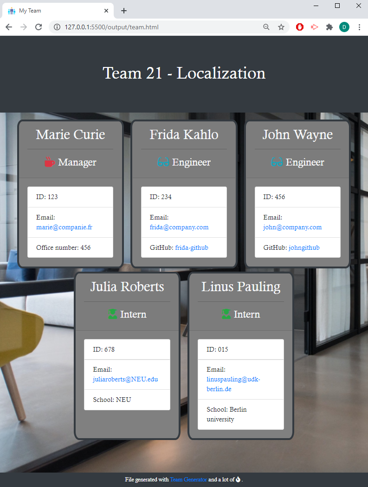

# 10-Team_Generation_CLI

 <a href="https://img.shields.io/badge/node-v12.19.0-orange?style=plastic"></a>
 <a href="https://img.shields.io/badge/npm-Inquirer-red?style=plastic"></a> 
<a href="https://img.shields.io/badge/js%20Library-Jest-blue?style=plastic"></a>
 <a href="https://img.shields.io/badge/License-MIT-brightgreen?style=plastic"></a>  

---

## Description
This app will generate a software engineering team from a user's inputs using the [Inquirer package](https://www.npmjs.com/package/inquirer).  

:information_source:  

```
User Story Acceptance Criteria
```
```
As a manager, I want to generate a webpage that displays my team's basic info
so that I have quick access to emails and GitHub profiles:  
WHEN I run the application,
THEN the application will prompt the user for information about the team manager
WHEN I enter the information about the team manager information, 
THEN the application will prompt the user for information about the team members
WHEN the user enter any number of team members
THEN they will be a mix of engineers and interns
WHEN I run the unit tests
THEN they all pass
WHEN the user has completed building the team
THEN the application will create an HTML file that displays a nicely formatted team roster based on the information provided by the user.
```


## Table of Contents  

* [Installation and Usage](#Installation-and-Usage)  
* [Images of the app](#Images-of-the-app-) 
* [Credits](#Credits)  
* [License](#License)  
* [Contact](#Contact) 


## Installation and Usage 
  
- Open a terminal instance  
- Clone the following [repo](https://github.com/Delph-Sunny/10-Team_Generator_CLI)  
- In the working directory, install the dependencies package, Inquirer and Jest with the following code line `npm i`  
- Once the dependencies have been installed, enter `node app.js`  
- Answer to each question following with Enter.   

###### Note: Node.js installation is required before using this app.  


## Images of the app :mag: 

- Running the app:  
  

  

- Running the Unit Tests:  
  


- A generated html file:  
 

## Credits
 
Icons made by Freepik from [www.flaticon.com](https://www.flaticon.com/)  
Background image by Nastuh Abootalebi from [www.unsplash.com](https://www.unsplash.com/)  
Code base prior to modification from Trilogy Education Services.


## License  

Copyright (c) 2021 DT.  
This project is [MIT](https://choosealicense.com/licenses/mit) licensed.

## Contact  

:octocat:  GitHub: [Delphine](https://github.com/Delph-Sunny)  


---